# Hyperion

[](https://discord.gg/PBfnDtj5Wb)
[](https://hyperion.rs/)
[](https://github.com/andrewgazelka/hyperion/issues)
[](https://github.com/andrewgazelka/hyperion/commits)

Hyperion is a **Minecraft game engine** that can have 10,000+ players in one world. Our pilot event hopes to break the PvP Guinness World
Record of ([8825 by
EVE Online](https://www.guinnessworldrecords.com/world-records/105603-largest-videogame-pvp-battle)). The
architecture is ECS-driven using [Bevy](https://bevy.org/).

> [!NOTE]  
> You can join the test server in 1.20.1 at `hyperion-test.duckdns.org`

https://github.com/user-attachments/assets/64a4a8c7-f375-4821-a1c7-0efc69c1ae0b


## Feature Status

| Feature                      | Status                                                                                                                                                                                        | Notes                                                                                                        |
|------------------------------|-----------------------------------------------------------------------------------------------------------------------------------------------------------------------------------------------|--------------------------------------------------------------------------------------------------------------|
| **Technical Infrastructure** |                                                                                                                                                                                               |                                                                                                              |
| 🧵 Multi-threading           | ✅ Implemented                                                                                                                                                                                 | Vertical scaling                                                                                             |
| 🔄 Proxy Layer               | ✅ Implemented                                                                                                                                                                                 | Horizontal scaling                                                                                           |
| 📊 Performance Tracing       | ✅ Implemented                                                                                                                                                                                 | Using Tracy profiler                                                                                         |
| 🛡️ Basic Anti-Cheat         | ✅ Implemented                                                                                                                                                                                 | Core anti-cheat functionality                                                                                |
| 🔧 Moderator Tools           | 🚧 WIP [#425](https://github.com/andrewgazelka/hyperion/issues/425), [@Kumpelinus](https://github.com/Kumpelinus)                                                                             | Admin controls and monitoring                                                                                |
| 🔌 Plugin API                | ✅ Implemented                                                                                                                                                                                 | Extensible plugin system; see [`events/bedwars`](https://github.com/hyperion-mc/hyperion/tree/main/events/bedwars) |
| **Core Game Mechanics**      |                                                                                                                                                                                               |                                                                                                              |
| 🧱 Block Breaking/Placing    | ✅ Implemented                                                                                                                                                                                 | Including physics simulation                                                                                 |
| 💫 Entity Collisions         | ✅ Implemented                                                                                                                                                                                 | Both entity-entity and block-entity                                                                          |
| 💡 Lighting Engine           | ✅ Implemented                                                                                                                                                                                 | Dynamic lighting updates                                                                                     |
| 🌐 World Borders             | ✅ Implemented                                                                                                                                                                                 | Configurable boundaries                                                                                      |
| 🛠️ Block Edit API           | ✅ Implemented                                                                                                                                                                                 | WorldEdit-like functionality                                                                                 |
| ⚔️ PvP Combat                | ✅ Implemented                                                                                                                                                                                 | Custom combat mechanics                                                                                      |
| 🎒 Inventory System          | ✅ Implemented                                                                                                                                                                                 | Full item management                                                                                         |
| 🎯 Raycasting                | ✅ Implemented | Required for ranged combat/arrows                                                                            |
| **Player Experience**        |                                                                                                                                                                                               |                                                                                                              |
| ✨ Particle Effects           | ✅ Implemented                                                                                                                                                                                 | Full particle support                                                                                        |
| 💬 Chat System               | ✅ Implemented                                                                                                                                                                                 | Global and proximity chat                                                                                    |
| ⌨️ Commands                  | ✅ Implemented                                                                                                                                                                                 | Custom command framework                                                                                     |
| 🎤 Proximity Voice           | ✅ Implemented                                                                                                                                                                                 | Using Simple Voice Chat                                                                                      |

## Benchmarks

| Players | Tick Time (ms) | Core Usage (%) | Total CPU Utilization (%) |
|---------|----------------|----------------|---------------------------|
| 1       | 0.24           | 4.3            | 0.31                      |
| 10      | 0.30           | 10.3           | 0.74                      |
| 100     | 0.46           | 10.7           | 0.76                      |
| 1000    | 0.40           | 15.3           | 1.09                      |
| 5000    | 1.42           | 35.6           | 2.54                      |


**Test Environment:**

- Machine: 2023 MacBook Pro Max 16" (14-cores)
- Chunk Render Distance: 32 (4225 total)
- Commit hash `faac9117` run with `just release`
- Bot Launch Command: `just bots {number}`

The bulk of player-specific processing occurs in our proxy layer, which handles tasks like regional multicasting and can
be horizontally scaled to maintain performance as player count grows.


## Architecture

### Overview

```mermaid
flowchart TB
    subgraph GameServer["Game Server (↕️ Scaled)"]
        direction TB
        subgraph BevyMT["Bevy Multi-threaded ECS"]
            direction LR
            IngressSys["Ingress System"] --> |"1 Game Tick (50ms)"| CoreSys["Core Systems (Game Engine)"] --> GameSys["Game Systems (Event Logic)"] --> EgressSys["Egress System"]
        end
        
        TokioIO["Tokio Async I/O"]
        TokioIO --> IngressSys
        EgressSys --> TokioIO
    end
    
    subgraph ProxyLayer["Proxy Layer (↔️ Scaled)"]
        direction TB
        Proxy1["Hyperion Proxy"]
        Proxy2["Hyperion Proxy"]
        ProxyN["Hyperion Proxy"]
        
        MulticastLogic["Regional Multicasting"]
    end
    
    subgraph AuthLayer["Authentication"]
        Velocity1["Velocity + ViaVersion"]
        Velocity2["Velocity + ViaVersion"]
        VelocityN["Velocity + ViaVersion"]
    end
    
    Player1_1((Player 1))
    Player1_2((Player 2))
    Player2_1((Player 3))
    Player2_2((Player 4))
    PlayerN_1((Player N-1))
    PlayerN_2((Player N))
    
    TokioIO <--> |"Rkyv-encoded"| Proxy1
    TokioIO <--> |"Rkyv-encoded"| Proxy2
    TokioIO <--> |"Rkyv-encoded"| ProxyN
    
    Proxy1 <--> Velocity1
    Proxy2 <--> Velocity2
    ProxyN <--> VelocityN
    
    Velocity1 --> Player1_1
    Velocity1 --> Player1_2
    Velocity2 --> Player2_1
    Velocity2 --> Player2_2
    VelocityN --> PlayerN_1
    VelocityN --> PlayerN_2
    
    classDef server fill:#f96,stroke:#333,stroke-width:4px
    classDef proxy fill:#9cf,stroke:#333,stroke-width:2px
    classDef auth fill:#fcf,stroke:#333,stroke-width:2px
    classDef ecs fill:#ff9,stroke:#333,stroke-width:3px
    classDef system fill:#ffd,stroke:#333,stroke-width:2px
    classDef async fill:#e7e7e7,stroke:#333,stroke-width:2px
    
    class GameServer server
    class BevyMT ecs
    class IngressSys,CoreSys,GameSys,EgressSys system
    class Proxy1,Proxy2,ProxyN proxy
    class Velocity1,Velocity2,VelocityN auth
    class TokioIO async
```


### Proxy

```mermaid
sequenceDiagram
    participant P as Player
    participant PH as Proxy Handler
    participant B as Broadcast System
    participant S as Game Server

    Note over P,S: Player → Server Flow
    P->>PH: Player Packet
    PH->>S: Forward Immediately

    Note over P,S: Server → Player Flow
    S->>B: Server Packets

    Note over B: Broadcasting Decision
    alt Local Broadcast
        B->>P: Send to nearby players (BVH)
    else Channel Broadcast
        B->>P: Send to subscribed players
    else Global Broadcast
        B->>P: Send to all players
    else Unicast
        B->>P: Send to specific player
    end
```




## Running

### Network topology

Hyperion uses one game server which runs all game-related code (e.g. physics, game events). One or more proxies can connect to the game server. Players connect to one of the proxies.

For development and testing purposes, it is okay to run one game server and one proxy on the same server. When generating keys, you will need to change the key and certificate file names used below to avoid file name conflicts.

On a production environment, the game server and each proxy should run on separate servers for performance.

### Generating keys and certificates

The connection between the game server and the proxies are encrypted through mTLS to ensure that the connection is secure and authenticate the proxies.

**Security warning:** All private keys must be stored securely, and it is strongly recommended to generate the private keys on the server that will use them instead of transferring them over the Internet. Malicious proxies that have access to a private key can circumvent player authentication and can cause the game server to exhibit undefined behavior which can potentially lead to arbitrary code execution on the game server. If any private key has been compromised, redo this section to create new keys.

#### Create a private certificate authority (CA)

A server should be picked to store the certificate authority keys and will be referred to as the cetificate authority server. Since the game server and all proxies are considered to be trusted, any of these servers may be used for this purpose.

On the certificate authority server, generate a key and certificate by running:

```bash
openssl req -new -nodes -newkey rsa:4096 -keyout root_ca.pem -x509 -out root_ca.crt -days 365
```

OpenSSL will ask for information when running the command. All fields can be left empty.

The `-days` field specifies when the certificate will expire. It will expire in 365 days in the above command, but this can be modified as needed.

`root_ca.crt` is the root CA cert and should be copied to the game server and all proxy servers. When running the game server or the proxy, make sure to pass `--root-ca-cert root_ca.crt` as a command line flag.

#### Generate server keys and certificates

Follow these instructions for the game server and each proxy server. The server will be referred to as the target server.

On the target server, run:

```bash
openssl req -nodes -newkey rsa:4096 -keyout server_private_key.pem -out server.csr
```

OpenSSL will ask for information when running the command. All fields can be left empty.

Afterwards, transfer `server.csr` to the certificate authority server. On the certificate authority server, run:

```bash
openssl x509 -req -in server.csr -CA root_ca.crt -CAkey root_ca.pem -CAcreateserial -out server.crt -days 365 -sha256 -extfile <(printf "subjectAltName=DNS:example.com,IP:127.0.0.1")
```

Replace `example.com` with the target server's domain name and replace `127.0.0.1` with the IP address that will be used by other servers to connect to the target server.
If the IP or domain provided is incorrect, connections will fail with the error "invalid peer certificate: certificate not valid for name ...".

The `-days` field specifies when the certificate will expire. It will expire in 365 days in the above command, but this can be modified as needed.

Then, transfer `server.crt` to the target server.

`server.csr` and `server.crt` on the certificate authority server and `server.csr` on the target server are no longer needed and may be deleted.

`server.crt` is the target server's certificate and `server_private_key.pem` is the target server's private key. When running the game server or the proxy, make sure to pass `--cert server.crt --private-key server_private_key.pem` as a command line flag.

### Without cloning

```bash
curl -L https://raw.githubusercontent.com/hyperion-mc/hyperion/main/docker-compose.yml | docker compose -f - up --pull always
```

### `main` branch

```bash
docker compose up --pull always
```

### With local build (for development)

```bash
docker compose up --build
```

## Features

**Language:** Rust  
**Goal:** Game engine for massive events  
**Structure:** Bevy ECS

**Platform Details:**
- Version: Minecraft 1.20.1
- Proxy Support: Velocity
- Proximity Voice: Simple Voice Chat
- Max estimated player count: ~176,056

**Note:** This feature list represents core functionality. Hyperion is designed to be modular meaning you can implement
your own mechanics and replace the core mechanics with your own.

## Star History

[](https://star-history.com/#andrewgazelka/hyperion&Date)


Thank you for your hard work[^1] [@CuzImClicks](https://github.com/CuzImClicks), [@Indra-db](https://github.com/Indra-db), [@james-j-obrien](https://github.com/james-j-obrien), [@Ruben2424](https://github.com/Ruben2424), [@SanderMertens](https://github.com/SanderMertens), [@Tebarem](https://github.com/Tebarem), and [@TestingPlant](https://github.com/TestingPlant).


[^1]: alphabetically ordered

