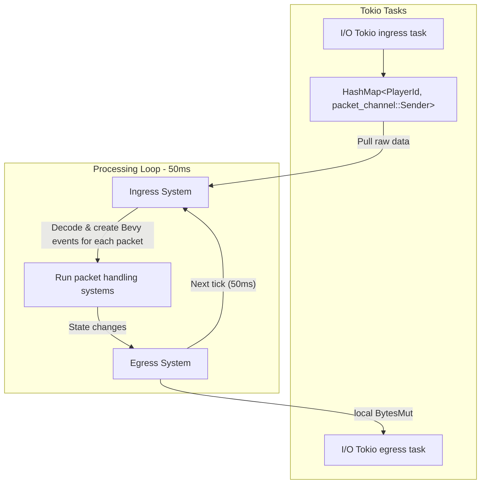

# Game Server

## Overview



## Egress

### Buffers

The systems are running in multiple threads with entities partitioned across them.
Suppose we have 8 threads[^1].

This means that the egress system will send thread-local 8 [
`bytes::BytesMut`](https://docs.rs/bytes/latest/bytes/struct.BytesMut.html)[^2]
to the tokio egress task at the end of every tick.

The contents in the buffers are [rkyv-encoded](https://github.com/rkyv/rkyv) packets
specified [here](https://github.com/andrewgazelka/hyperion/blob/main/crates/hyperion-proto/src/server_to_proxy.rs):

```rust
#[derive(Archive, Deserialize, Serialize, Clone, PartialEq)]
pub struct BroadcastLocal<'a> {
    pub center: ChunkPosition,
    pub exclude: u64,
    pub order: u32,

    #[rkyv(with = InlineAsBox)]
    pub data: &'a [u8],
}

#[derive(Archive, Deserialize, Serialize, Clone, PartialEq)]
pub struct Unicast<'a> {
    pub stream: u64,
    pub order: u32,

    #[rkyv(with = InlineAsBox)]
    pub data: &'a [u8],
}
```

## Ingress

### Packet Channel

The packet channel is a linked list of `Fragment`. Each fragment contains:
- an incremental fragment id
- a `Box<[u8]>` with zero or more contiguous packets with a `u32` length prefix before each packet
- a read cursor, where `0..read_cursor` is ready to read and contains whole packets
- an `ArcSwapOption<Fragment>` pointing to the next fragment if there is one

As packets from the client are processed in the proxy thread, the server decodes the `VarInt` length prefix to
determine the packet size. If there is enough space remaining in the current fragment, the packet bytes are copied to
the current fragment. Otherwise, a new fragment will be allocated and appended to the linked list.

The decoding system, running in separate threads, iterates through the linked list and reads packets up to the read
cursor. These packets are decoded, sent through Bevy events, and then processed by other systems which read those
events.

When a packet contains a reference to the original packet bytes, such as a chat message packet storing a reference to
the message, we use `bytes::Bytes` and the variants made in `valence_bytes` (e.g. `valence_bytes::Utf8Bytes` which
wraps a `bytes::Bytes` while guaranteeing that it is valid UTF-8) to allow the packet event to live for `'static` while
only performing one copy[^3] throughout the entire ingress system.

This custom channel is more performant than a traditional channel of `Box<[u8]>` because it allows reusing the same
allocation for several packets, and most packets are very small.

[^1]: the actual number is assigned at compile-time for maximum performance and is usually equal to the number of cores
on the machine.

[^2]: `bytes::BytesMut` re-uses the underlying buffer and tracks allocations and deallocations so allocations each tick
are not needed.

[^3]: The copy is done when copying from the proxy's `PlayerPackets` packet to the packet channel. Theoretically this
could be made zero-copy by reading from the TCP stream directly into the packet channel, but this would be less
performant because it would increase the number of read syscalls by requiring one read syscall per player, and
syscalls are more expensive than small memory copies.
